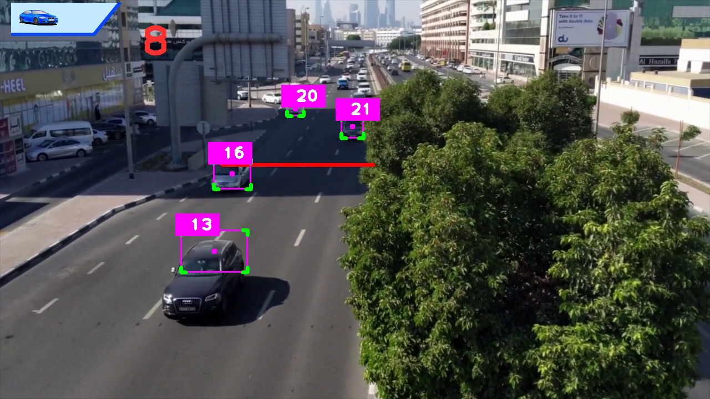

# Project 1 - Car Counter

This project detects vehicles in a road video, tracks them across frames, and counts each vehicle once when it crosses a counting line.

## Files

- `car-counter.py` runs detection, tracking, and counting.
- `sort.py` provides the tracker used for persistent object IDs.
- `mask.png` defines the detection region.
- `graphics.png` is the on-screen overlay graphic.

## Requirements

Install dependencies from the repository root:

```bash
pip install -r requirements.txt
```

Required files expected by the script:

- `../Yolo-Weights/yolov8l.pt`
- `../Videos/cars.mp4`

## Run

From this folder:

```bash
python car-counter.py
```

## Screenshot

Generated from a local run of the project:



## How It Works

1. The script opens the traffic video.
2. The first frame is used to size the mask correctly.
3. YOLO detects objects inside the masked region.
4. Vehicle classes such as `car`, `truck`, `bus`, and `motorbike` are kept.
5. SORT tracks each detection and assigns an ID.
6. When a tracked center crosses the counting line, that ID is added once to the total count.

## Output

The result window displays:

- tracked vehicle boxes
- tracker IDs
- a counting line
- the total vehicle count

## Notes

- Paths are relative, so run the script from this directory.
- The script uses `Videos` in the file path. If your local folder is named `videos`, update the path or rename the directory.
- The class filter condition in the script mixes `or` and `and`. If you want confidence filtering applied equally to all vehicle classes, the condition should be grouped explicitly.
